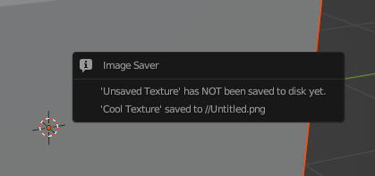

# Blender Image Saver

When you save your .blend file (e.g. by `Ctrl-S`), this add-on will check if you have any unsaved images, and attempt to save those as well.

When you save, if you have any unsaved images, you will get a popup like this one. Any images that exist on disk will be saved, and any images that have not been saved will show a warning, so you know to save them.

If there are no unsaved images, no popup will be shown.